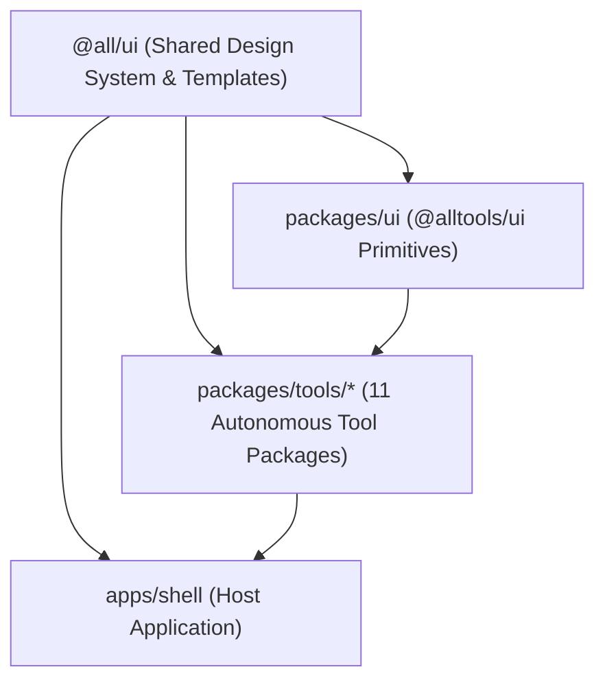

# AllTools

<p align="center">
  <strong>A minimalist sketch-and-ink suite of browser-based utilities and daily tools.</strong><br>
  No servers, no tracking, no accounts — 100% client-side, offline-ready Progressive Web App (PWA).<br>
  Available in English and Polish.
</p>

<p align="center">
  <a href="https://github.com/patrasxd/AllTools/blob/main/LICENSE"></a>
  
  
  
  
  
</p>

---

## Table of Contents

- [Overview](#overview)
- [Key Features](#key-features)
- [Tools Catalog](#tools-catalog)
- [Architecture & Monorepo](#architecture--monorepo)
- [Responsive Layout Templates](#responsive-layout-templates)
- [Design System & Themes](#design-system--themes)
- [Tool API Contract](#tool-api-contract)
- [Getting Started](#getting-started)
- [Adding a New Tool](#adding-a-new-tool)
- [Storage & Privacy](#storage--privacy)
- [License](#license)

---

## Overview

**AllTools** is an open-source collection of fast, private browser utilities designed for everyday productivity, hardware measurements, media manipulation, and calculations. Every tool runs entirely within your browser engine — your files, audio inputs, microphone feeds, and notes never leave your machine.

Packaged as an npm workspaces monorepo and styled with a tactile ink-and-paper aesthetic, AllTools combines the instant access of web applications with the security and offline reliability of native desktop software.

---

## Key Features

- 🔒 **100% Client-Side Privacy**: Zero analytics, zero telemetric beacons, zero cloud dependencies. Your files and sensor feeds remain on your device.
- 📴 **Offline PWA Capability**: Precached with Service Workers for complete functionality even without internet connectivity.
- 📐 **Calibrated Viewport Allocation**: Built on reusable `@all/ui` responsive templates (`SplitWorkspaceLayout`, `CenteredUtilityLayout`, `FullBleedLayout`) preventing awkward page scrolling.
- 🌓 **4 Visual Themes**: Light, Dark, E-Ink Light (pure black-and-white, zero drop-shadows, crisp contrast for e-readers), and E-Ink Dark.
- 🎬 **Dedicated Motion Infrastructure**: Fine-tuned Framer Motion animations with instant OS `prefers-reduced-motion` compliance and forced zero-motion in E-Ink modes.
- 🌐 **Instant Bilingual Support**: Full English and Polish localizations toggleable at runtime.
- 🧪 **High Test Reliability**: Exhaustive Vitest suites covering audio DSP, sensor math, PDF manipulation, and cryptographic primitives.

---

## Tools Catalog

AllTools currently provides **11 high-utility tools**:

| Tool | Slug | Category | Template | Key Capabilities |
| :--- | :--- | :--- | :--- | :--- |
| **Sound Meter** | `sound-meter` | Audio / Sensor | `FullBleedLayout` | Real-time acoustic noise meter via microphone input with dBA/dBZ frequency weighting, peak hold, and live audio oscilloscope. |
| **Dev Vault** | `dev-vault` | Utility / Dev | `SplitWorkspaceLayout` | CSPRNG password & passphrase generator, UUIDv4, SHA/MD5 hashing, Base64 encoder/decoder, JWT payload inspector, and IPv4/CIDR subnet calculator. |
| **PDF Suite** | `pdf-suite` | Documents | `SplitWorkspaceLayout` | In-browser PDF toolkit powered by `pdf-lib` & `pdfjs-dist`: merge documents, extract/split pages, rotate orientations, and convert images into PDF. |
| **Image Studio** | `image-studio` | Media / Graphics | `CenteredUtilityLayout` | Client-side image editor: crop, resize, text/image watermarking, quality compression, and conversion between PNG, JPEG, WebP, and HEIC (`heic2any`). |
| **Calc & Converter** | `calc-converter` | Math / Utility | `CenteredUtilityLayout` | Dual-mode calculator (Standard & Scientific) paired with multi-unit converter across Length, Mass, Temperature, Speed, Time, and Digital Storage. |
| **Guitar Tuner** | `guitar-tuner` | Audio | `FullBleedLayout` | High-precision chromatic and guitar tuner using real-time Web Audio FFT pitch detection, note frequency gauge, and reference tone generator. |
| **Level & Protractor** | `level-protractor` | Measurement | `FullBleedLayout` | Dual-axis bubble level using DeviceOrientation API, calibrated tubular spirit level, and interactive touch-canvas protractor with angle lock. |
| **Screen Ruler** | `screen-ruler` | Measurement | `FullBleedLayout` | Screen-calibrated on-screen ruler supporting millimeters, centimeters, and inches with standard credit-card PPI calibration and dual-axis calipers. |
| **QR Suite** | `qr-suite` | Utility | `SplitWorkspaceLayout` | Offline QR Code generator (URL, text, WiFi credentials, vCard) with custom sizing and error correction, paired with live camera & file QR scanner. |
| **Stopwatch & Interval**| `stopwatch-interval` | Time | `CenteredUtilityLayout` | Precision stopwatch with millisecond timing, lap recordings, split differences, and customizable interval HIIT workout timer with audio beeps. |
| **Quick Notes** | `quick-notes` | Productivity | `SplitWorkspaceLayout` | Minimalist offline scratchpad and checklist with markdown support, color tags, live text search, and automatic local persistence. |

---

## Architecture & Monorepo

AllTools is architected as an **npm workspaces monorepo** driven by Vite and TypeScript, consuming the shared neutral UI system (`@all/ui`):



### Directory Tree

```
AllTools/
├── package.json                   # Root monorepo configuration & scripts
├── README.md                      # Project documentation
│
├── apps/
│   └── shell/                     # Host application (Vite + React + TS + PWA)
│       ├── src/
│       │   ├── tools/             # Eager metadata registry & dynamic tool loaders
│       │   ├── i18n/              # Shell translations & context (EN / PL)
│       │   ├── components/        # AppHeader, ToolCard, Navigation
│       │   ├── pages/             # HomePage, ToolPage (zero-scroll container)
│       │   ├── styles/            # Shell tokens & layout CSS
│       │   ├── types/             # ToolMetadata & ToolComponentProps contracts
│       │   ├── App.tsx            # Routes & animated transitions
│       │   └── main.tsx           # ThemeProvider, MotionProvider, React root
│       ├── public/
│       │   ├── manifest.webmanifest # PWA manifest
│       │   └── icons/             # Application icons & SVG favicon
│       └── vite.config.ts         # Vite configuration with PWA plugin
│
├── packages/
│   ├── ui/                        # Tool-specific UI wrappers (@alltools/ui)
│   └── tools/                     # 11 Standalone Tool Packages
│       ├── calc-converter/
│       ├── dev-vault/
│       ├── guitar-tuner/
│       ├── image-studio/
│       ├── level-protractor/
│       ├── pdf-suite/
│       ├── qr-suite/
│       ├── quick-notes/
│       ├── screen-ruler/
│       ├── sound-meter/
│       └── stopwatch-interval/
│
└── AllUI/                         # Git Submodule referencing @all/ui design system
```

---

## Responsive Layout Templates

Rather than arbitrary layout sizing, every tool in AllTools is built upon reusable responsive templates from `@all/ui`:

1. **`SplitWorkspaceLayout`**:
   - Ideal for workbench workflows where input/controls live on the left (or top on mobile) and live output/preview occupies the right (or bottom on mobile).
   - Used by: `dev-vault`, `pdf-suite`, `qr-suite`, `quick-notes`.
2. **`CenteredUtilityLayout`**:
   - Ideal for focused card utilities, converters, and timers requiring clean vertical or grid centering.
   - Used by: `calc-converter`, `image-studio`, `stopwatch-interval`.
3. **`FullBleedLayout`**:
   - Intended for sensor-driven, canvas, or direct physical measurement interfaces requiring edge-to-edge touch allocation without page scrolling.
   - Used by: `sound-meter`, `guitar-tuner`, `level-protractor`, `screen-ruler`.

---

## Design System & Themes

All visual primitives and tokens originate from `@all/ui`:

- **Design Tokens**: Standard CSS custom properties (`--all-bg`, `--all-surface`, `--all-border`, `--all-text`, `--all-accent`, `--all-space-*`).
- **Typography**: Clean, readable system sans-serif hierarchy for UI elements, paired with `ui-monospace` for data, hashes, and calculations.
- **Supported Themes**:
  - `dark`: High-contrast dark theme (default).
  - `light`: Clean ink-on-paper light aesthetic.
  - `e-ink-light`: High-contrast pure black/white theme with zero animations and solid borders for e-paper screens.
  - `e-ink-dark`: Inverted monochrome E-Ink palette.
- **Motion Profiles**: Configurable between `none`, `normal`, and `expressive`, with automatic `none` override under E-Ink and `prefers-reduced-motion`.

---

## Tool API Contract

Every tool in `packages/tools/<slug>` is a self-contained module exporting its metadata and component.

### 1. Metadata Export (`src/metadata.tsx`)

```tsx
import React from 'react'
import { IconGuitar } from '@all/ui'
import type { ToolMetadata } from '../../../apps/shell/src/types/tool'

export const metadata: ToolMetadata = {
  slug: 'guitar-tuner',
  name: {
    en: 'Guitar Tuner',
    pl: 'Tuner Gitarowy',
  },
  description: {
    en: 'Accurate chromatic and guitar tuner with real-time frequency analysis & reference tones.',
    pl: 'Precyzyjny tuner chromatyczny i gitarowy z analizą częstotliwości w czasie rzeczywistym.',
  },
  icon: <IconGuitar size={24} strokeWidth={1.5} />,
  category: 'audio',
  tags: {
    en: ['Audio', 'Instrument', 'Pitch'],
    pl: ['Audio', 'Instrument', 'Dźwięk'],
  },
}
```

### 2. Component Export (`src/index.tsx`)

```tsx
export * from './metadata'
export { GuitarTuner as ToolComponent } from './GuitarTuner'
```

### 3. Component Props (`ToolComponentProps`)

```ts
export interface ToolComponentProps {
  /** Current language code ('en' | 'pl') */
  locale: 'en' | 'pl'
  /** Optional callback to render custom actions/widgets into the top shell header */
  setHeader?: (content: React.ReactNode) => void
  /** Optional callback for persisting arbitrary data */
  onSave?: (data: unknown) => void
}
```

---

## Getting Started

### Prerequisites

- **Node.js**: `18.0.0` or higher
- **npm**: `9.0.0` or higher (supporting npm workspaces)

### Installation & Run

```bash
# Clone repository with submodules
git clone --recurse-submodules https://github.com/patrasxd/AllTools.git
cd AllTools

# Install monorepo dependencies
npm install

# Start local development server
npm run dev

# Run Vitest test suite across all tools
npm test

# Build production bundle
npm run build

# Preview production build locally
npm run preview
```

---

## Adding a New Tool

1. **Scaffold Package**:
   Create a new package directory under `packages/tools/<new-tool>` with its own `package.json` named `@alltools/<new-tool>`.
2. **Select Layout Template**:
   Choose the appropriate template from `@all/ui` (`SplitWorkspaceLayout`, `CenteredUtilityLayout`, or `FullBleedLayout`).
3. **Implement Logic & UI**:
   Implement your tool components using design tokens and controls from `@all/ui`.
4. **Export Metadata & Component**:
   Create `src/metadata.tsx` and export `{ metadata, ToolComponent }` from `src/index.tsx`.
5. **Register in Shell Registry**:
   Add the tool metadata to `TOOLS_METADATA` and dynamic loader to `loaders` in `apps/shell/src/tools/registry.ts`.
6. **Add Unit & Integration Tests**:
   Write test suites under `src/__tests__/` and run `npm test`.

---

## Storage & Privacy

All data is stored purely in client-side browser `localStorage` or `IndexedDB` under organized prefixes:

| Key Format | Type | Description |
| :--- | :--- | :--- |
| `alltools:theme` | `'dark' \| 'light' \| 'e-ink-light' \| 'e-ink-dark'` | User theme preference |
| `alltools:language` | `'en' \| 'pl'` | User language preference |
| `alltools:notes:*` | `JSON Object` | Quick Notes saved items and checklists |
| `alltools:ruler:ppi` | `number` | Calibrated screen pixels-per-inch |

No data, file contents, camera feeds, or audio waveforms are transmitted over the network.

---

## License

This project is licensed under the [MIT License](LICENSE).
